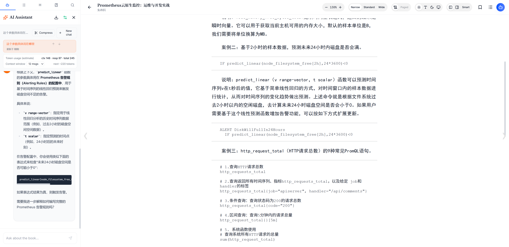

# Lumina Reader

[English](#english) | [中文](#中文)

---

## English

A modern AI-powered reading app that supports multiple formats and enhanced reading workflows.

### Product Screenshot

### Features

- Multi-format reading support (EPUB / PDF / Markdown / TXT / Web)
- Highlighting, notes, bookmarks, and search
- Reader layout/theme customization
- AI-assisted reading interactions
- Progress persistence and telemetry feedback

### Current Limitations & Roadmap

Lumina Reader is currently in a testing and feedback stage. The following points describe known limitations and planned improvements:

1. **Data persistence (currently browser-based)**
   - At the moment, most reading data is stored in browser local storage.
   - If you change devices, clear browser data, or switch environments, some data may be lost.
   - We plan to introduce more reliable storage options (such as cloud/backend persistence) to improve cross-device continuity and data safety.

2. **PDF rendering (currently direct reading)**
   - PDF files are currently loaded and rendered in a direct/basic way.
   - We plan to provide a more scientific and user-friendly PDF reading experience, including better structure display and interaction improvements.

3. **Deployment options (currently frontend-only)**
   - Right now, we only provide a simple frontend deployment approach.
   - In upcoming versions, we plan to add more deployment and delivery options, including Docker images and client versions.

4. **Localization / i18n support**
   - The project will support multiple languages.
   - Chinese language support is in the roadmap and will be added progressively.

5. **Vector database retrieval support**
   - We plan to add vector database integration to enable retrieval-augmented reading and knowledge search workflows.

6. **Extended AI capabilities**
   - Future versions may support advanced AI features such as voice interaction and mind map generation.
   - We will also provide extension points so users can customize and expand AI capabilities.

7. **Reading analytics visualization**
   - We plan to provide visualized reading insights, including habit tracking, progress tracking, and reading duration statistics.

8. **Testing & feedback phase**
   - The project is currently in a testing and feedback collection stage.
   - If you encounter any issue or have any feature request, please open an Issue in this repository.

### Run Locally

**Prerequisites**

- Node.js (recommended LTS)

1. Install dependencies:
   `npm install`
2. Start development server:
   `npm run dev`

### Build

`npm run build`

### Deploy

Deploy with your preferred frontend hosting provider (for example: Vercel / Netlify / Cloudflare Pages).

### Commercial & License

Lumina Reader follows an **open-source + commercial** strategy.

- Community features are open for transparency, adoption, and developer collaboration.
- Enterprise-focused capabilities (for example: advanced deployment, compliance features, or dedicated support) may be provided under commercial terms.

**Recommended licensing approach (planned):**

- Community Edition: **AGPLv3** (or another OSS license based on final legal review)
- Commercial Edition / Enterprise delivery: **Commercial License**

> Note: The final license text and commercial terms should always be based on your published `LICENSE` file and official announcements.

### Contributing

Contributions are welcome.

If you want to contribute:

1. Fork this repository
2. Create your feature branch
3. Commit your changes with clear messages
4. Open a Pull Request

Please also consider:

- Searching existing Issues before creating a new one
- Providing reproducible steps for bugs
- Describing expected behavior vs actual behavior
- Keeping PRs focused and easy to review

### Feedback & Issues

This project is in an active testing and feedback stage.

- Found a bug? Open an Issue.
- Have a feature request? Open an Issue with details and use cases.
- Want roadmap discussion? Join the conversation in Issues.

---

## 中文

一个现代化的 AI 阅读应用，支持多种文档格式和增强阅读工作流。

### 产品截图

### 功能特性

- 支持多格式阅读（EPUB / PDF / Markdown / TXT / 网页）
- 高亮、笔记、书签、搜索
- 阅读布局与主题可自定义
- AI 辅读交互能力
- 阅读进度持久化与状态反馈

### 当前限制与后续规划

Lumina Reader 目前处于测试和反馈阶段，以下为已知问题与后续计划：

1. **数据存储（当前主要在浏览器）**
   - 目前阅读数据主要保存在浏览器本地存储中。
   - 如果更换设备、清理浏览器数据或切换环境，可能会出现数据丢失。
   - 后续会接入更稳定的存储方案（如云端/后端持久化），提升数据安全性与多端连续性。

2. **PDF 阅读展示（当前为直接读取）**
   - 目前 PDF 以直接加载和基础展示为主。
   - 后续会提供更科学、更友好的 PDF 展现与交互方式，优化阅读结构和体验。

3. **部署形态（当前以简单前端部署为主）**
   - 目前仅提供基础前端部署方式。
   - 后续计划增加更多形态，包括 Docker 部署、客户端版本等。

4. **多语言支持**
   - 后续将逐步提供多语言支持。
   - 已计划补充中文等语言能力。

5. **向量数据库检索能力**
   - 计划支持向量数据库集成，用于增强语义检索与知识召回能力。

6. **扩展 AI 功能**
   - 后续计划支持语音、思维导图等 AI 能力。
   - 同时会提供可扩展机制，便于用户按需扩展自定义能力。

7. **阅读数据可视化分析**
   - 计划支持阅读数据可视化，包含阅读习惯追踪、进度跟踪与阅读时长统计。

8. **测试反馈阶段说明**
   - 当前项目处于测试与反馈收集阶段。
   - 任何问题、建议或需求，欢迎通过 Issues 提交反馈。

### 本地运行

**环境要求**

- Node.js（建议使用 LTS 版本）

1. 安装依赖：
   `npm install`
2. 启动开发环境：
   `npm run dev`

### 构建

`npm run build`

### 部署

可部署到任意前端托管平台（例如：Vercel / Netlify / Cloudflare Pages）。

### 商业化与许可

Lumina Reader 采用 **开源 + 商业化** 的双轨策略。

- 社区能力保持开源，用于透明协作、用户增长与生态建设。
- 面向企业的能力（如高级部署、合规能力、专属支持等）可通过商业授权提供。

**建议的许可方案（规划中）：**

- 社区版：**AGPLv3**（或基于最终法务评估选择合适开源协议）
- 商业版 / 企业交付：**Commercial License（商业许可）**

> 说明：最终以仓库中发布的 `LICENSE` 文件与官方公告为准。

### 贡献指南

欢迎参与贡献。

如果你想参与开发：

1. Fork 本仓库
2. 创建功能分支
3. 提交清晰的 Commit
4. 发起 Pull Request

建议同时注意：

- 提交前先搜索是否已有相关 Issues
- Bug 反馈尽量提供可复现步骤
- 清晰描述“预期行为”与“实际行为”
- 保持 PR 聚焦，便于快速评审

### 反馈与问题提交

当前项目处于持续测试与反馈收集阶段。

- 发现 Bug：请提交 Issue
- 有功能建议：请在 Issue 中说明场景与预期
- 想参与路线讨论：欢迎在 Issues 里交流
